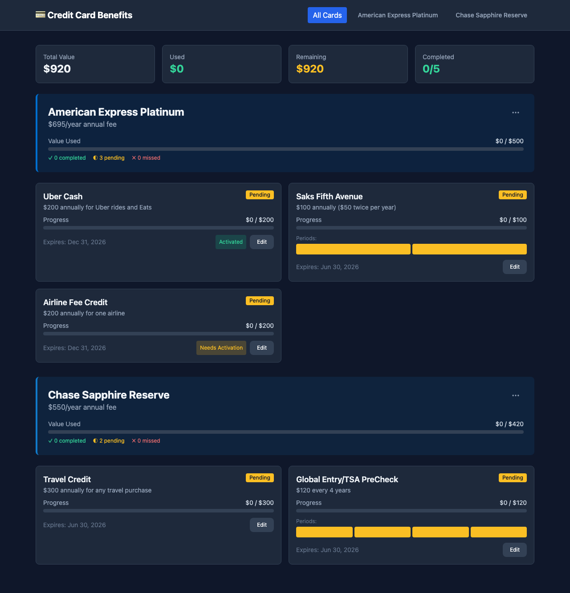

# Keep Your Benefits



A fully static web application to track credit card benefits for Amex Platinum and Chase Sapphire Reserve, with usage tracking, progress visualization, and activation reminders.

## Features

- **Track Benefits**: Monitor all your credit card benefits in one place
- **Progress Visualization**: Visual progress bars showing usage status
  - Green: Completed
  - Yellow: Pending
  - Red: Missed/Expired
- **Multiple Reset Frequencies**: Annual, twice-yearly, quarterly, and monthly tracking
- **Activation Tracking**: Highlight benefits requiring activation with acknowledgment toggle
- **Expiration Reminders**: See when benefits expire and how many days remain
- **Multi-Card Support**: Mix Amex Platinum and Chase Sapphire Reserve benefits
- **Offline-Ready**: All user data stored locally in your browser

## Tech Stack

- **Runtime**: [Bun](https://bun.sh/)
- **Language**: TypeScript
- **Frontend**: [React](https://react.dev/) + [Vite](https://vitejs.dev/)
- **Styling**: [Tailwind CSS](https://tailwindcss.com/)
- **Data Storage**: 
  - Benefit definitions: Static JSON (`/benefits.json`)
  - User data: Browser localStorage

## Project Structure

```
keep-your-benefits/
├── client/                      # Frontend (React + Vite)
│   ├── public/
│   │   └── benefits.json        # Static benefit definitions
│   └── src/
│       ├── api/client.ts        # Fetches static JSON
│       ├── components/          # React components
│       │   ├── BenefitCard.tsx
│       │   ├── CardHeader.tsx
│       │   ├── EditModal.tsx
│       │   ├── ProgressBar.tsx
│       │   └── Tooltip.tsx
│       ├── hooks/               # Custom React hooks
│       ├── pages/               # Page components
│       │   ├── Dashboard.tsx
│       │   └── CardDetail.tsx
│       ├── services/            # Business logic (merges with localStorage)
│       ├── storage/             # localStorage CRUD
│       ├── types/               # TypeScript types
│       └── utils/               # Helper functions
├── shared/                      # Shared types and utilities
│   ├── types.ts
│   └── utils.ts
├── e2e/                         # Playwright E2E tests
│   ├── playwright.config.js
│   └── browser.test.js
└── dist/                        # Production build output
```

## Getting Started

### Prerequisites

- [Bun](https://bun.sh/) installed (version 1.0.0+)

### Installation

```bash
bun install
```

### Running the Application

```bash
bun run dev
```

Then open http://localhost:5173 in your browser.

### Building for Production

```bash
# Build static files to dist/
bun run build

# Preview production build locally
bun run preview
```

### Running Tests

```bash
# Run E2E tests
bun run test:e2e

# Install Playwright browsers (first time only)
bun run test:e2e:install
```

### Linting

```bash
# Run oxlint
bun run lint

# Run with all plugins
bun run check
```

## Deployment

This is a fully static app - no server required. To deploy:

1. Build: `bun run build`
2. Upload contents of `dist/` to any static host:
   - GitHub Pages
   - Netlify
   - Vercel
   - AWS S3 + CloudFront
   - Any web server

## Seeded Benefits

### Amex Platinum (Calendar Year Reset)

- **Hotel Credit** - $600 twice-yearly ($300 each period)
- **Uber Cash** - $200 annually ($15 monthly + $20 December bonus)
- **Saks Fifth Avenue** - $100 twice-yearly ($50 each period)
- **Airline Fee Credit** - $200 annually (requires airline selection)
- **Digital Entertainment** - $240 annually ($20/month)
- **Walmart+** - $155 annually
- **Equinox** - $300 annually ($25/month)
- **Clear Plus** - $199 annually
- **Global Entry/TSA PreCheck** - $100 every 4.5 years

### Chase Sapphire Reserve (Anniversary Reset)

- **Travel Credit** - $300 annually
- **DoorDash DashPass** - Complimentary membership
- **Lyft Credit** - $60 annually ($5/month)
- **Instacart+ Credit** - $180 annually ($15/month)

## Data Storage

- **Benefit definitions**: Stored in `client/public/benefits.json` (static, version-controlled)
- **User data**: Stored in browser `localStorage` under key `user-benefits`
  - Usage amounts
  - Activation acknowledgments
  - Ignored/hidden benefits
  - Period-specific tracking

## Data Model

### Credit Card
```typescript
{
  id: string;
  name: string;
  annualFee: number;
  resetBasis: 'calendar-year' | 'anniversary';
  color: string;
}
```

### Benefit Definition
```typescript
{
  id: string;
  cardId: string;
  name: string;
  shortDescription: string;
  fullDescription: string;
  creditAmount: number;
  resetFrequency: 'annual' | 'twice-yearly' | 'quarterly' | 'monthly';
  activationRequired: boolean;
  startDate: string;
  endDate: string;
  category: string;
  periods?: BenefitPeriod[];
}
```

### User State (localStorage)
```typescript
{
  benefits: {
    [benefitId: string]: {
      currentUsed: number;
      activationAcknowledged: boolean;
      status: 'pending' | 'completed' | 'missed';
      ignored: boolean;
      periods?: Record<string, { usedAmount: number; status: string }>;
    }
  }
}
```

## License

MIT
